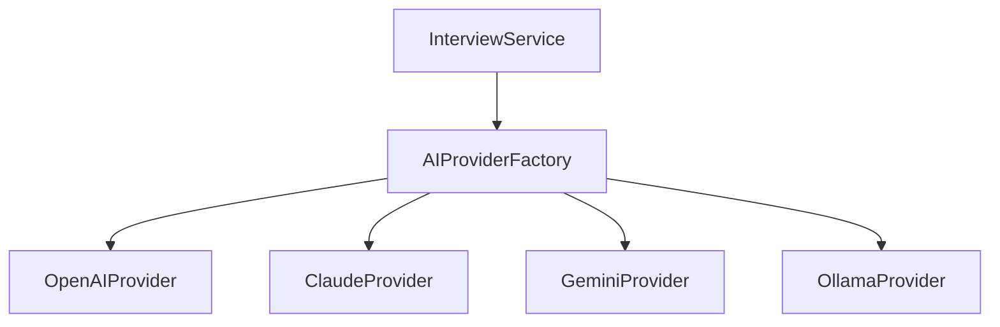

# AI Interview Coach - Backend API

This is the core engine powering the AI Interview Coach. It manages users, interview sessions, AI-driven learning paths, and real-time mock interviews.

## 🚀 Tech Stack & Rationale

| Technology | Role | Why? |
| :--- | :--- | :--- |
| **Node.js + Express** | Web Framework | Lightweight, non-blocking I/O, and perfect for handling asynchronous AI requests. |
| **TypeScript** | Language | Provides type-safety, which is critical for complex data models and AI responses. |
| **PostgreSQL** | Primary Database | Relational database for robust data integrity and complex relationships between users, interviews, and topics. |
| **Knex.js** | Query Builder | Flexible SQL builder that allows us to write performant queries while maintaining database portability. |
| **Redis** | Speed/Sessions | Used for high-speed session management and as a message broker for background jobs. |
| **BullMQ** | Background Jobs | Handles long-running tasks like generating complex learning roadmaps without blocking the main event loop. |
| **Pino** | Logging | High-performance, low-overhead logging essential for production debugging. |
| **Passport.js** | Authentication | Modular authentication middleware used here for Google OAuth 2.0. |

---

## 🏗️ Architecture & Design Patterns

### 1. Strategy Pattern: Multi-LLM Support
The backend is designed to be model-agnostic. We use the **Strategy Pattern** to swap between different AI providers (Ollama, OpenAI, Claude, Gemini) without changing the business logic.



### 2. Controller-Service-Repository Pattern
- **Routes**: Define endpoints and handle basic request validation.
- **Controllers**: Orchestrate data flow between routes and services.
- **Services**: Contain the core business logic (e.g., how an interview progresses).
- **Database (Knex)**: Handles data persistence.

### 3. Asynchronous Task Processing
Generating a personalized roadmap takes time. To provide a smooth user experience, we use **BullMQ**.
1. User requests a roadmap.
2. The `WorkspaceService` adds a job to the Redis queue.
3. The API immediately returns a `202 Accepted`.
4. The `RoadmapWorker` picks up the job, calls the AI, and saves the result to the DB.
5. Frontend polls for the result.

---

## 🧠 Logical Deep Dives (Interview Prep)

### A. The "Adaptive Interview" Logic
**Aim**: To simulate a real interviewer who asks follow-up questions based on the user's previous answer.

**Solution**:
1. **State Persistence**: We store the entire `conversation_history` in the DB.
2. **Contextual Prompting**: We feed the last 5-10 messages back to the LLM with a system prompt like: *"You are a Senior Engineer. The candidate just said X. Assess their technical depth and ask a harder follow-up."*
3. **Sentiment Analysis (Implicit)**: We use the LLM to categorize the user's response (Correct / Partially Correct / Incorrect) to determine the next question's difficulty.

### B. Roadmap Generation Algorithm
**Aim**: Create a structured learning path for any technical topic.

**Algorithm**:
1. **Recursion (Logic)**: If a topic is complex (e.g., "Kubernetes"), the system breaks it into sub-topics.
2. **Logical Sequencing**: We prompt the AI to return JSON with `dependency` IDs.
3. **Graph Rendering**: The frontend uses these dependencies to render the path in the correct order.

---

## 🛠️ Security & Scaling
- **JWT + Sessions**: Dual layer of security for API access and session persistence.
- **Environment Isolation**: Strict `.env` usage to prevent credential leaks.
- **Graceful Shutdown**: Handlers for `SIGTERM` to ensure database and redis connections close properly.

---

## 🔮 Future Backend Improvements
- [ ] **Rate Limiting**: Implement `express-rate-limit` to prevent API abuse.
- [ ] **Unit Testing**: Add `Jest` or `Mocha` for service-layer testing.
- [ ] **Vector Database**: Integrate `ChromaDB` or `Pinecone` for RAG (Retrieval Augmented Generation) to provide more accurate interview feedback.
- [ ] **WebSocket Support**: Replace polling with WebSockets for real-time interview transcripts.

---

## ⚙️ Environment Variables
Check `.env.example` for the full list of required variables.
```bash
PORT=3001
DATABASE_URL=postgres://...
REDIS_URL=redis://...
OLLAMA_URL=http://...
JWT_SECRET=...
```
